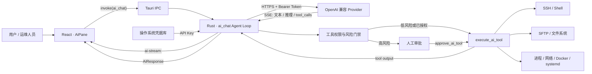
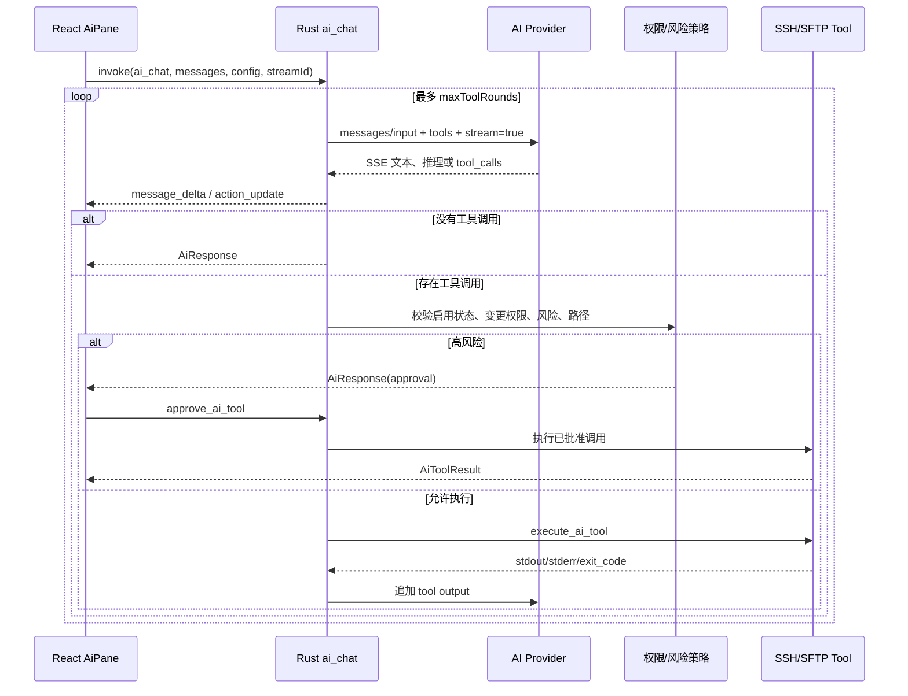
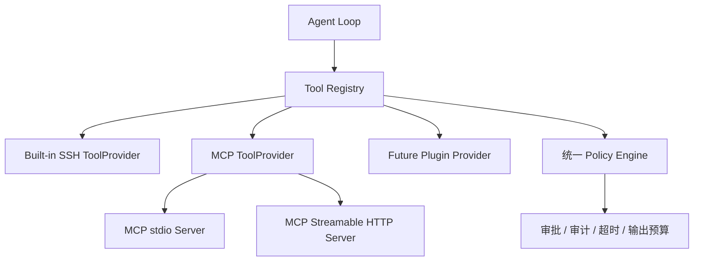

# Portico SSH 的 AI 连接与外部工具接入技术解析

> 面向对象：AI 应用工程师、桌面端工程师、平台工程师、SRE、安全工程师<br>
> 分析范围：模型 Provider 接入、流式响应、Function Calling、SSH/SFTP 工具执行、人工审批与上下文管理<br>
> 项目版本：Portico SSH 0.1.0，基于 2026-08-03 当前工作区代码

## 1. 分享目标

本文回答四个核心问题：

1. Portico SSH 如何连接 OpenAI 兼容模型，并兼容 Chat Completions 与 Responses 两种 API。
2. 模型如何获得 SSH、SFTP、系统诊断等外部能力，并形成多轮 Agent 工具调用闭环。
3. 流式文本、推理摘要、工具状态和最终结果如何跨越 Provider、Rust 后端与 React 前端。
4. 当前架构的安全边界、技术限制，以及演进到 MCP/动态工具生态所需的改造。

## 2. 结论先行

Portico SSH 的 AI 子系统采用了典型的 **桌面端 Agent + 本地可信执行器** 架构：

- React 前端负责会话状态、流式渲染、工具卡片和人工审批交互。
- Tauri/Rust 后端负责读取密钥、调用模型 API、解析 SSE、执行 Agent 循环和实施安全策略。
- 模型不直接连接 SSH。模型只能生成结构化工具调用，由 Rust 后端校验后通过 `ssh2`、SFTP 或已有 Tauri 命令执行。
- 工具接入采用 OpenAI Function Calling 风格的静态工具目录，同时适配 Chat Completions 和 Responses API。
- 工具执行结果会在同一次 `ai_chat` 请求中重新注入模型，直到模型给出最终文本或达到最大工具轮数。
- 高风险调用会暂停 Agent 循环，返回待审批对象；用户批准后由独立的 `approve_ai_tool` 命令执行。
- 当前项目 **没有实现 MCP Client、工具服务器动态发现或插件式 Tool Provider**。所谓“外部工具”本质上是本地编译的结构化工具适配器，其执行目标主要是当前 SSH 服务器。

一句话概括：**模型负责决策，Rust 负责协议适配、权限控制与真实执行，React 负责可视化和人在回路。**

## 3. 总体架构



### 3.1 关键模块

| 模块 | 主要职责 |
|---|---|
| [`src/components/AiPane.tsx`](../src/components/AiPane.tsx) | 发送消息、订阅流事件、合并文本/推理/工具状态、审批交互 |
| [`src/components/SettingsDialog.tsx`](../src/components/SettingsDialog.tsx) | Provider、模型、上下文、工具权限和安全策略设置 |
| [`src/types.ts`](../src/types.ts) | 前端 AI 配置、消息、工具结果和流事件类型 |
| [`src/App.tsx`](../src/App.tsx) | 配置持久化；剔除 API Key 后写入 `localStorage` |
| [`src-tauri/src/lib.rs`](../src-tauri/src/lib.rs) | Provider 请求、SSE 解析、Agent 循环、工具定义、工具执行、安全门禁、凭据读取 |
| [`src/aiHistory.ts`](../src/aiHistory.ts) | 会话历史的本地持久化与裁剪 |

### 3.2 信任边界

该系统存在四个安全域：

1. **模型域**：模型输出不可信，包括工具名、参数、命令和路径。
2. **WebView 域**：负责 UI，但不应持有长期密钥或直接执行远端命令。
3. **Rust 本地域**：可信策略执行点，负责鉴权、校验、审批和审计信息生成。
4. **远端服务器域**：最终副作用发生的位置，权限上限由 SSH 登录账户决定。

核心原则是：**任何模型生成的副作用都必须经过 Rust 本地策略层。**

## 4. AI Provider 连接原理

### 4.1 统一配置模型

前后端共同维护以下配置：

- `apiMode`：`chat-completions` 或 `responses`。
- `endpoint`：Provider 基础地址，也允许用户直接填写具体 API 路径。
- `apiKey`：只在保存时写入操作系统凭据库。
- `model`：模型 ID。
- `contextWindow`、`maxOutputTokens`、`temperature`：推理资源控制。
- `autoCompress`：上下文超限前是否调用模型生成交接摘要。
- `tools`：工具开关、最大轮数、输出上限、命令超时和变更权限。

Rust 使用枚举统一两种 API 模式：

```rust
enum AiApiMode {
    ChatCompletions,
    Responses,
}

impl AiApiMode {
    fn endpoint_path(self) -> &'static str {
        match self {
            Self::ChatCompletions => "chat/completions",
            Self::Responses => "responses",
        }
    }
}
```

源码：[`src-tauri/src/lib.rs:201`](../src-tauri/src/lib.rs#L201)

### 4.2 Endpoint 归一化

用户可以填写：

- `https://api.openai.com/v1`
- `https://api.openai.com/v1/chat/completions`
- `https://api.openai.com/v1/responses`
- 其他实现 OpenAI 兼容协议的网关地址

后端会先剥离已存在的具体路径，再拼接当前模式要求的路径：

```rust
fn ai_endpoint(endpoint: &str, path: &str) -> String {
    let base = endpoint.trim().trim_end_matches('/');
    let base = ["/chat/completions", "/responses"]
        .into_iter()
        .find_map(|suffix| base.strip_suffix(suffix))
        .unwrap_or(base);
    format!("{base}/{path}")
}
```

源码：[`src-tauri/src/lib.rs:3250`](../src-tauri/src/lib.rs#L3250)

这使模型列表、Chat Completions 和 Responses 可以共享同一个基础地址。模型列表通过 `GET {base}/models` 获取。

### 4.3 密钥保存与读取

前端持久化配置时主动移除 `apiKey`：

```ts
const serializeAiConfig = ({ apiKey: _apiKey, ...config }: AiConfig) => config;

if (isTauri() && nextConfig.apiKey.trim()) {
  await invoke("store_ai_key", { apiKey: nextConfig.apiKey.trim() });
}
localStorage.setItem(AI_CONFIG_STORAGE_KEY, JSON.stringify(serializeAiConfig(nextConfig)));
```

源码：[`src/App.tsx:34`](../src/App.tsx#L34)、[`src/App.tsx:283`](../src/App.tsx#L283)

Rust 侧以 `com.portico.ssh` 为服务名写入操作系统凭据库，实际请求前再读取 `ai:api-key`：

```rust
const KEYRING_SERVICE: &str = "com.portico.ssh";

fn read_secret(account: &str) -> Option<String> {
    keyring_entry(account).ok()?.get_password().ok()
}
```

源码：[`src-tauri/src/lib.rs:708`](../src-tauri/src/lib.rs#L708)、[`src-tauri/src/lib.rs:1057`](../src-tauri/src/lib.rs#L1057)

这避免了长期密钥进入 WebView `localStorage`。但单次保存期间 API Key 仍会经过 Tauri IPC，因此 IPC 命令权限和前端供应链仍属于安全边界。

### 4.4 两种请求协议的适配

内部统一使用 `AiInputMessage`、JSON 工具定义和 `AiStreamCompletion`，只在 Provider 边界转换协议。

#### Chat Completions

```json
{
  "model": "...",
  "messages": [],
  "temperature": 0.2,
  "stream": true,
  "stream_options": { "include_usage": true },
  "tools": [],
  "tool_choice": "auto"
}
```

#### Responses

```json
{
  "model": "...",
  "instructions": "...",
  "input": [],
  "temperature": 0.2,
  "max_output_tokens": 4096,
  "stream": true,
  "store": false,
  "tools": [],
  "tool_choice": "auto"
}
```

Responses API 的工具格式没有外层 `function` 对象，因此后端会转换：

```rust
fn responses_tool_definitions(tools: &[Value]) -> Vec<Value> {
    tools.iter().filter_map(|tool| {
        let function = tool.get("function")?;
        Some(json!({
            "type": "function",
            "name": function.get("name")?.clone(),
            "description": function.get("description").cloned().unwrap_or(Value::Null),
            "parameters": function.get("parameters").cloned().unwrap_or_else(|| json!({})),
            "strict": false
        }))
    }).collect()
}
```

源码：[`src-tauri/src/lib.rs:3293`](../src-tauri/src/lib.rs#L3293)

### 4.5 请求生命周期

`ai_chat` 是整个 AI 子系统的主入口：

1. 校验上下文、最大输出和温度。
2. 从请求或操作系统凭据库取得 API Key。
3. 构造包含当前 SSH 目标、附件约束和风险要求的 system prompt。
4. 必要时压缩历史对话。
5. 根据开关生成工具定义。
6. 计算输入成本和可用输出预算。
7. 请求 Provider 并读取流式响应。
8. 若模型返回工具调用，执行策略校验和工具执行。
9. 将工具结果重新注入下一轮 Provider 请求。
10. 无工具调用时返回最终 `AiResponse`。

主入口：[`src-tauri/src/lib.rs:4572`](../src-tauri/src/lib.rs#L4572)

## 5. 流式响应与协议归一化

### 5.1 Rust 侧 SSE 读取

项目没有依赖专门的 SSE 客户端，而是在 `reqwest::Response::chunk()` 上自行按换行拆分 `data:`：

```rust
while let Some(chunk) = response.chunk().await? {
    buffer.extend_from_slice(&chunk);
    while let Some(end) = buffer.iter().position(|byte| *byte == b'\n') {
        let line = buffer.drain(..=end).collect::<Vec<_>>();
        process_ai_stream_line(&line, &mut completion, app, event_name)?;
    }
}
```

源码：[`src-tauri/src/lib.rs:3175`](../src-tauri/src/lib.rs#L3175)

如果响应不是 SSE，代码会退化为普通 JSON body 解析，提高部分兼容网关的可用性。

### 5.2 兼容的增量类型

解析器统一处理：

- Chat Completions：`choices[0].delta.content`。
- Provider 扩展推理字段：`reasoning_content`、`reasoning`、`thinking`。
- Chat Completions 工具调用：增量拼接 `function.name` 和 `function.arguments`。
- Responses 文本：`response.output_text.delta`。
- Responses 推理摘要：`response.reasoning_summary_text.delta`。
- Responses 工具参数：`response.function_call_arguments.delta/done`。
- Responses 完成、未完成和错误事件。
- 两类协议的 token usage、cached tokens 和 reasoning tokens。

核心分流：[`src-tauri/src/lib.rs:2915`](../src-tauri/src/lib.rs#L2915)

### 5.3 Tauri 事件桥

每次请求生成唯一 `streamId`，Rust 向动态事件名发送增量：

```rust
let stream_event_name = format!("ai-stream:{stream_id}");
app.emit(event_name, delta).ok();
```

前端先订阅事件，再调用 `ai_chat`：

```ts
const unlisten = await listen<AiStreamDelta>(`ai-stream:${streamId}`, ({ payload }) => {
  if (payload.eventType === "message_delta") {
    streamedContent += payload.content ?? "";
    streamedReasoning += payload.reasoning ?? "";
  }
  if (payload.eventType === "action_update" && payload.toolCall) {
    streamedToolCalls = mergeStreamedToolCall(streamedToolCalls, payload.toolCall, nextTimelineSequence);
  }
  scheduleStreamFlush();
});

const response = await invoke<AiResponse>("ai_chat", { config, server, messages, streamId });
```

源码：[`src/components/AiPane.tsx:832`](../src/components/AiPane.tsx#L832)

前端通过 `requestAnimationFrame` 批量刷新，避免每个 token 都触发 React 状态更新。

## 6. 外部工具接入原理

### 6.1 当前实现不是 MCP

当前代码中没有以下能力：

- MCP Server 配置与连接管理。
- `tools/list` 动态工具发现。
- MCP stdio、SSE 或 Streamable HTTP 传输。
- 外部工具命名空间、动态 schema 缓存和连接健康检查。

当前工具由 Rust 代码静态声明，并编译进桌面应用。其“外部性”体现在：模型通过这些适配器访问 SSH 服务器、SFTP、Docker、systemd、进程和网络等外部系统。

### 6.2 工具目录

| 分类 | 工具 | 执行目标 | 可能产生副作用 |
|---|---|---|---|
| 命令 | `execute_command` | 远端 Shell | 是，统一按变更型处理 |
| 命令 | `background_task` | 远端后台进程 | `start/stop` 是 |
| 命令 | `pty_interaction` | 远端一次性交互 | 是 |
| 文件 | `read_file` | 远端文本文件 | 否 |
| 文件 | `write_file` | 远端文件 | 是 |
| 文件 | `sftp_upload` | 本机到远端 | 是 |
| 文件 | `sftp_download` | 远端到本机 | 是，本机文件系统发生写入 |
| 文件 | `list_directory` | 远端目录 | 否 |
| 诊断 | `get_system_metrics` | CPU/内存/磁盘/网络/GPU | 否 |
| 诊断 | `process_manager` | 远端进程 | `terminate` 是 |
| 诊断 | `network_checker` | 连接、网卡、Ping、端口 | 否 |
| 服务 | `docker_manager` | Docker | 生命周期操作是 |
| 服务 | `systemd_control` | systemd | 生命周期操作是 |
| 安全 | `risk_checker` | 本地规则引擎 | 否 |
| 知识 | `snippet_library` | 内置只读命令片段 | 否 |
| 日志 | `log_analyzer` | 文件或 journal | 否 |

工具开关来自 [`src/types.ts:202`](../src/types.ts#L202)，UI 分组来自 [`src/components/SettingsDialog.tsx:42`](../src/components/SettingsDialog.tsx#L42)。

### 6.3 Function Calling Schema

所有工具最终统一为 JSON Schema：

```rust
fn ai_function_tool(name: &str, description: &str, properties: Value, required: &[&str]) -> Value {
    json!({
        "type": "function",
        "function": {
            "name": name,
            "description": description,
            "parameters": {
                "type": "object",
                "properties": properties,
                "required": required,
                "additionalProperties": false
            }
        }
    })
}
```

源码：[`src-tauri/src/lib.rs:3829`](../src-tauri/src/lib.rs#L3829)

`ai_tool_definitions` 只暴露设置中启用的工具。因此工具开关不仅影响 UI，也影响模型能否看到工具 schema。

### 6.4 工具执行分派

`execute_ai_tool` 是执行适配器。它将模型生成的结构化参数映射到三类实现：

1. **Shell 适配器**：如 `execute_command`、`read_file`、`docker_manager`。
2. **已有 Tauri/SSH 能力复用**：如 `list_processes`、`list_network_connections`。
3. **SFTP 适配器**：如 `upload_file`、`download_file`、`list_directory`。

```rust
async fn execute_ai_tool(...) -> Result<AiToolExecution, String> {
    let execution = match name {
        "execute_command" => {
            let command = required_ai_arg(arguments, "command")?.to_string();
            let result = run_ai_command(server, command.clone(), settings).await?;
            AiToolExecution { display_command: command, result }
        }
        "list_directory" => {
            let path = optional_ai_arg(arguments, "path", "/");
            let result = list_directory(server.clone(), path.clone()).await
                .map(|entries| json_command_result(&entries))
                .unwrap_or_else(ai_blocked_result);
            AiToolExecution { display_command: format!("list_directory {path}"), result }
        }
        // process/network/docker/systemd/SFTP 等分支
        _ => return Err(format!("不支持的 AI 工具: {name}")),
    };
    Ok(execution)
}
```

源码：[`src-tauri/src/lib.rs:4224`](../src-tauri/src/lib.rs#L4224)

所有远端 Shell 命令都会经过超时包装，并放入阻塞线程执行，避免阻塞 Tauri async runtime：

```rust
let command = bounded_ai_command(&command, settings.command_timeout_seconds);
tauri::async_runtime::spawn_blocking(move || run_command_sync(&server, &command)).await?
```

源码：[`src-tauri/src/lib.rs:4009`](../src-tauri/src/lib.rs#L4009)

## 7. Agent 工具循环

### 7.1 时序



### 7.2 工具调用解析与执行

模型返回的工具调用需要经过以下步骤：

1. 拼接流式 `function.arguments`。
2. 使用 `serde_json` 解析为 JSON。
3. 再次确认工具在设置中启用。
4. 判断是否为变更型工具，以及用户是否允许变更。
5. 将工具参数还原为可供风险分析的命令。
6. 命中高危规则时返回审批对象。
7. 否则执行并生成标准化 `AiToolResult`。
8. 截断输出，防止工具结果挤爆上下文。

核心循环：[`src-tauri/src/lib.rs:4664`](../src-tauri/src/lib.rs#L4664)、[`src-tauri/src/lib.rs:4780`](../src-tauri/src/lib.rs#L4780)

### 7.3 工具结果回灌

同一个内部结果会转换为两种协议：

```rust
api_messages.push(json!({
    "role": "tool",
    "tool_call_id": call_id,
    "content": output.clone()
}));

if api_mode.is_responses() {
    response_inputs.push(json!({
        "type": "function_call_output",
        "call_id": call_id,
        "output": output
    }));
}
```

源码：[`src-tauri/src/lib.rs:3333`](../src-tauri/src/lib.rs#L3333)

Responses 模式还会保存原始 `response.output_item`，在下一轮请求中重放 `function_call` item，再追加对应的 `function_call_output`。这是 Responses 工具循环能够连续工作的关键。

### 7.4 输出预算

工具输出不是简单按字符截断。系统先估算当前上下文中：

- system instructions 成本；
- 工具 schema 成本；
- 当前用户轮次成本；
- 当前及后续工具结果的 envelope 成本；
- 预留的模型输出空间。

然后为并行返回的多个工具调用分配预算，最终再受 `maxOutputChars / 4` 限制。相关实现：[`src-tauri/src/lib.rs:3429`](../src-tauri/src/lib.rs#L3429)、[`src-tauri/src/lib.rs:4985`](../src-tauri/src/lib.rs#L4985)。

## 8. 安全控制与人工审批

### 8.1 分层防御

| 层级 | 控制 | 目的 |
|---|---|---|
| 暴露层 | `autoExecute` 关闭时不向模型发送任何工具 | 彻底关闭 Agent 执行能力 |
| 工具层 | 每个工具独立启用/禁用 | 最小能力集 |
| 变更层 | `allowMutatingTools` | 控制所有可能产生副作用的工具 |
| 参数层 | 必填字段、枚举、PID、端口、服务名校验 | 限制无效或异常输入 |
| 命令层 | `shell_quote`、命令模板 | 降低结构化工具的注入风险 |
| 风险层 | `risk_reasons` 静态规则 | 识别删除、格式化、关机、防火墙等高风险动作 |
| 审批层 | 前端批准后调用 `approve_ai_tool` | 人在回路 |
| 路径层 | 阻止写入 `/etc`、`/boot`、`/usr` 等路径 | 保护关键系统目录 |
| 资源层 | 命令超时、工具轮数、输出和上下文预算 | 防止失控、阻塞和上下文膨胀 |
| 凭据层 | OS Keyring | 避免密钥长期保存在 WebView |

### 8.2 变更型工具判断

```rust
fn ai_tool_is_mutating(name: &str, arguments: &Value) -> bool {
    match name {
        "execute_command" | "write_file" | "sftp_upload" | "sftp_download"
        | "pty_interaction" => true,
        "process_manager" => arguments.get("action").and_then(Value::as_str) == Some("terminate"),
        "docker_manager" => matches!(
            arguments.get("action").and_then(Value::as_str),
            Some("pull" | "start" | "stop" | "restart" | "rm")
        ),
        _ => false,
    }
}
```

源码：[`src-tauri/src/lib.rs:4129`](../src-tauri/src/lib.rs#L4129)

### 8.3 高风险审批

命中 `risk_reasons` 后，`ai_chat` 不执行工具，而是返回：

- 用户可见提示；
- 风险原因；
- 工具名、展示命令和原始参数；
- 已完成工具调用列表；
- token usage。

前端只在内存 Map 中暂存审批参数。用户批准后调用 `approve_ai_tool`，后端会再次检查工具启用状态、变更权限和受保护路径，然后执行。

审批后端：[`src-tauri/src/lib.rs:4535`](../src-tauri/src/lib.rs#L4535)<br>
审批前端：[`src/components/AiPane.tsx:607`](../src/components/AiPane.tsx#L607)

## 9. 上下文与会话管理

### 9.1 上下文裁剪

每次请求前按估算 token 从最新轮次向前保留消息。Responses 模式按完整用户轮次分组，避免只保留工具结果而丢失对应的用户输入。

### 9.2 自动压缩

当历史消息超过触发阈值时，后端额外调用同一个模型，把较早的完整轮次压缩为交接摘要，再保留最近消息继续会话。

压缩摘要要求保留：

- 用户目标和已确认事实；
- 命令、结果、文件路径和函数；
- 决策、约束、风险、错误和待办事项。

源码：[`src-tauri/src/lib.rs:3512`](../src-tauri/src/lib.rs#L3512)

### 9.3 附件处理

附件不会作为视觉输入直接发送给模型。前端将图片或大文本通过 Tauri/SFTP 上传到远端临时目录，消息中只注入远端路径、类型和大小。模型需要再调用 `read_file` 或其他服务器工具检查内容。

这是一种 **文件引用式上下文**，优点是避免大文件直接占用模型上下文；限制是当前并没有真正的多模态图像上传协议，模型也不能仅凭路径看到图片。

源码：[`src-tauri/src/lib.rs:1892`](../src-tauri/src/lib.rs#L1892)、[`src-tauri/src/lib.rs:263`](../src-tauri/src/lib.rs#L263)

## 10. 前端状态模型

前端把一次 AI 回复表示为可组合时间线：

- 文本增量；
- 一个或多个推理摘要块；
- 工具 `started/running/finished/error` 状态；
- 审批卡片；
- token usage；
- 最终完成或错误状态。

`AiStreamDelta.eventType` 将事件分为：

- `message_delta`：文本或推理增量；
- `action_update`：工具生命周期增量。

工具调用使用稳定 `id` 合并，`sequence` 保证推理块与工具卡片按实际发生顺序呈现。流式阶段结束后，最终 `AiResponse.toolCalls` 会与流事件结果再次去重合并。

相关实现：[`src/components/AiPane.tsx:158`](../src/components/AiPane.tsx#L158)、[`src/components/AiPane.tsx:215`](../src/components/AiPane.tsx#L215)、[`src/components/AiPane.tsx:843`](../src/components/AiPane.tsx#L843)。

## 11. 工程评审：优势与限制

### 11.1 设计优势

1. **执行权不在模型侧**：模型只能请求工具，不能绕过 Rust 策略直接操作 SSH。
2. **协议隔离良好**：内部统一模型使 Chat Completions 和 Responses 共享绝大多数逻辑。
3. **工具复用度高**：Agent 工具直接复用已有 SSH、SFTP、进程和网络能力。
4. **可观测性较好**：工具生命周期、命令、输出、退出码和时间戳对用户可见。
5. **资源边界完整**：同时限制上下文、输出、命令时间和工具轮数。
6. **密钥边界合理**：长期 API Key 不进入 `localStorage`。
7. **Responses 工具重放正确**：保存 output item 并追加 `function_call_output`，符合连续工具调用所需的状态模型。

### 11.2 需要关注的限制

| 优先级 | 问题 | 影响 | 建议 |
|---|---|---|---|
| 高 | 前端 `DEFAULT_AI_TOOL_SETTINGS.allowMutatingTools` 为 `true`，Rust `Default` 为 `false` | “变更能力默认关闭”的安全语义在前后端不一致；新用户实际走前端默认值 | 统一为 `false`，增加配置迁移和端到端测试 |
| 中 | 人工批准后只执行 `approve_ai_tool`，不会自动把结果回灌原 Agent 循环 | 用户能看到执行结果，但模型不会自动基于结果生成最终结论 | 将 pending call 持久化为可恢复 Agent state，批准后继续下一轮模型请求 |
| 中 | 工具目录静态编译，无 MCP 或插件注册表 | 接入新工具必须修改 Rust、重新编译和发布 | 抽象 `ToolProvider`，增加 MCP Provider 和动态工具发现 |
| 中 | 高危检测基于字符串模式 | 容易出现编码、Shell 变体、间接命令和脚本包装造成的漏报 | 对结构化工具采用动作级风险元数据；任意 Shell 引入策略引擎或更严格审批 |
| 中 | JSON Schema 主要约束模型，不是完整的服务端 schema validator | 额外字段和复杂约束不会被统一验证 | 在执行前使用 JSON Schema 校验器或强类型参数枚举 |
| 中 | 历史会话不会按原生 tool message 保存并发送 | 跨用户轮次时，模型主要依赖最终文本，不保留原始工具协议和完整输出 | 持久化规范化 conversation items，按预算保留最近工具证据 |
| 中 | Provider 鉴权固定为 Bearer Token | Azure、自定义签名、组织头等 Provider 需要额外适配 | 引入 Provider Profile 和可控自定义 Header 模板 |
| 低/中 | SSE 解析器按单行 `data:` 处理 | 对多行 SSE data、自定义 event frame 的兼容性有限 | 使用标准 SSE parser，保持现有普通 JSON fallback |
| 低/中 | 前端取消仅通过版本号忽略结果 | 后端 HTTP/SSH 工作可能继续消耗资源 | 增加 cancellation token 和 Tauri cancel command |

默认值差异可在 [`src/types.ts:225`](../src/types.ts#L225) 与 [`src-tauri/src/lib.rs:174`](../src-tauri/src/lib.rs#L174) 对照确认。

## 12. 演进到 MCP/动态外部工具

当前 Provider 协议适配、Agent 循环和结果回灌逻辑都可以复用。建议把静态 `execute_ai_tool` 重构为工具注册表，而不是在 `match` 中继续堆叠分支。

### 12.1 建议目标架构



### 12.2 建议接口

```rust
trait ToolProvider {
    fn definitions(&self) -> Vec<ToolDefinition>;
    fn risk(&self, name: &str, arguments: &Value) -> ToolRisk;
    async fn invoke(
        &self,
        name: &str,
        arguments: Value,
        context: &ToolContext,
    ) -> Result<ToolExecution, ToolError>;
}
```

统一的数据结构至少应包含：

- `provider_id`、`tool_name`、`qualified_name`；
- JSON Schema 与 schema 版本；
- 只读/变更/高风险级别；
- timeout、最大输出、取消能力；
- 用户授权范围和服务器作用域；
- 原始内容、模型可见内容和审计摘要。

### 12.3 MCP 接入步骤

1. 增加 MCP Server 配置：传输类型、命令/URL、环境变量、启动超时。
2. 建立连接管理器，支持启动、重连、健康检查和关闭。
3. 调用 `tools/list`，将 MCP schema 转为内部 `ToolDefinition`。
4. 使用命名空间避免冲突，例如 `mcp__github__create_issue`。
5. 把内置工具与 MCP 工具合并后，继续使用现有 Chat/Responses 转换层。
6. 工具调用时由 Registry 路由到对应 Provider。
7. MCP 返回内容先经过大小、类型、敏感信息和风险过滤，再进入模型上下文。
8. 对每个 Server、工具和风险等级建立独立授权，而不是一个全局变更开关。
9. 把 pending approval 与 Agent state 持久化，使批准后能够恢复模型循环。

### 12.4 不建议直接动态执行任意命令

MCP 接入不等于信任 MCP Server。远程 MCP 工具描述、参数和返回值同样属于不可信输入。必须保留现有 Rust 策略层，并把以下内容纳入统一控制：

- Server 身份与来源；
- 工具 schema 变更；
- 环境变量和密钥注入；
- 本地文件、网络和进程权限；
- 用户审批和审计记录；
- 输出截断、敏感信息脱敏和 prompt injection 防护。

## 13. 测试与验证现状

Rust 测试已覆盖若干核心风险点：

- 高风险命令识别；
- 工具超时下限；
- 工具开关与默认暴露范围；
- 变更型工具授权；
- Chat/Responses 流式文本、推理、工具参数和 usage 解析；
- Responses endpoint 与工具格式；
- 工具输出和上下文裁剪。

测试入口：[`src-tauri/src/lib.rs:5069`](../src-tauri/src/lib.rs#L5069)<br>
安全测试示例：[`src-tauri/src/lib.rs:5243`](../src-tauri/src/lib.rs#L5243)<br>
流式协议测试示例：[`src-tauri/src/lib.rs:5324`](../src-tauri/src/lib.rs#L5324)

建议补充：

1. 前后端默认工具权限一致性测试。
2. 高风险审批后恢复 Agent 循环的端到端测试。
3. 多行 SSE、半包、粘包、无尾换行和超大事件测试。
4. Provider 鉴权适配测试。
5. JSON Schema 服务端验证测试。
6. 工具取消、Provider 超时和 SSH 中断测试。
7. 恶意工具输出导致 prompt injection 的隔离测试。

## 14. 分享总结

Portico SSH 已经具备一个完整的本地 Agent 骨架：

```text
用户消息
  → Provider 请求
  → 流式解析
  → 模型生成结构化工具调用
  → 本地权限与风险校验
  → SSH/SFTP 实际执行
  → 工具结果回灌模型
  → 最终回答与可视化时间线
```

这套架构最有价值的部分不是“让模型执行命令”，而是把 **模型决策、可信执行、安全审批、协议适配、流式体验** 分成了清晰层次。

后续若要接入真正的外部工具生态，最佳路径不是继续扩充 `match`，而是提炼统一 Tool Registry 与 Tool Provider 接口，在现有 Agent 循环之外增加 MCP 连接、动态发现和细粒度权限控制。这样既能保留当前 SSH 工具的安全优势，也能把系统扩展为通用桌面 Agent 平台。

## 15. 建议分享节奏（45 分钟）

| 时间 | 内容 |
|---|---|
| 5 分钟 | 项目背景、目标与核心结论 |
| 8 分钟 | Tauri 三层架构与信任边界 |
| 8 分钟 | Chat Completions / Responses 协议适配与流式解析 |
| 10 分钟 | Function Calling、Agent 循环、工具结果回灌 |
| 7 分钟 | 安全策略、人工审批与上下文预算 |
| 5 分钟 | 当前限制与 MCP 演进方案 |
| 2 分钟 | 总结与问答引导 |

建议演示路径：模型请求系统状态 → `get_system_metrics` → 工具状态流式展示 → 工具结果回灌 → 最终分析；随后演示一个命中风险规则的命令及人工审批流程。
